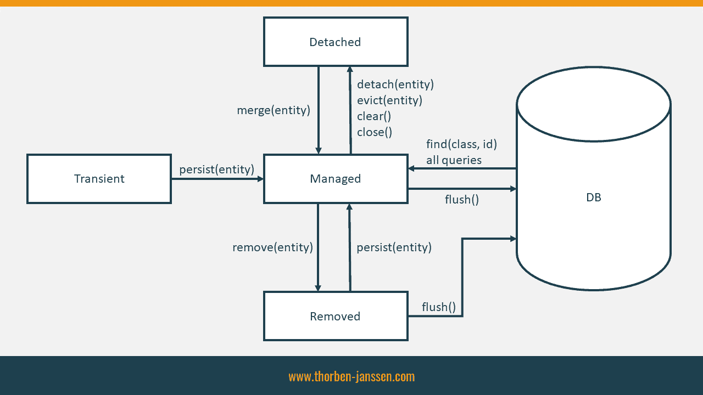

## **HIBERNATE**

[Hibernate](https://hibernate.org) - **Hibernate ORM** (or simply **Hibernate**) is an [object–relational mapping](https://en.wikipedia.org/wiki/Object%E2%80%93relational_mapping "Object–relational mapping") tool for the [Java](https://en.wikipedia.org/wiki/Java_(programming_language)) "Java (programming language)") programming language. It provides a [framework](https://en.wikipedia.org/wiki/Software_framework "Software framework") for mapping an [object-oriented](https://en.wikipedia.org/wiki/Object-oriented_programming "Object-oriented programming") domain model to a [relational database](https://en.wikipedia.org/wiki/Relational_database "Relational database"). Hibernate handles [object–relational impedance mismatch](https://en.wikipedia.org/wiki/Object%E2%80%93relational_impedance_mismatch "Object–relational impedance mismatch") problems by replacing direct, [persistent](https://en.wikipedia.org/wiki/Persistence_(computer_science)) "Persistence (computer science)") database accesses with high-level object handling functions.

# Entity Lifecycle Model in JPA

Se also: [Lifecycle Model](https://thorben-janssen.com/entity-lifecycle-model/)
